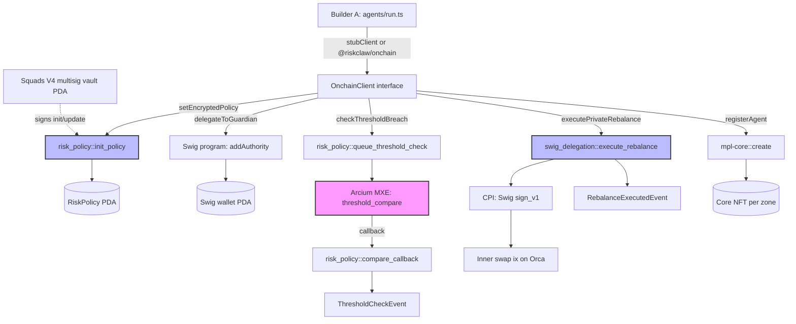

# Builder B — Programs + Privacy PRD

| Field | Value |
|---|---|
| **Project** | RiskClaw-Sol — institutional risk-ops layer on Solana |
| **Scope** | Builder B's surface: Anchor programs, Arcis circuit, `@riskclaw/onchain` TS package, deploy + agent-registration scripts |
| **Branch** | `builder-b/foundation` |
| **Status** | Draft — pending Builder B sign-off + Builder A boundary review |
| **Priority** | P0 (entire cryptographic + onchain layer of the project) |
| **Effort** | L — multi-language (Rust + TS), multi-program, novel cryptographic primitive |
| **Out of scope** | Frontend, Helius observation, agent orchestration loop, demo video — all owned by Builder A |

---

## 0. Breaking Changes

This PRD introduces components that did not previously exist in the repo. Integrating them affects:

- **New Anchor workspace at `/programs`** — `risk_policy` and `swig_delegation` programs. Adds a Rust toolchain + Solana CLI + Anchor 1.0.2 + Cargo workspace requirement to the developer environment.
- **New Arcis circuit at `/encrypted/threshold_compare`** — adds `arcup` toolchain dependency.
- **New TypeScript workspace package `packages/onchain` (= `@riskclaw/onchain`)** — Builder A's `agents/src/run.ts` switches `stubClient` → `RealClient` once this ships. Until the swap, Builder A continues running against the stub.
- **The `OnchainClient` interface is locked** — currently lives at `agents/src/onchain-client.ts`. Builder B owns the *implementation* but cannot change the *signature* without coordinating with Builder A.
- **Three new keypairs** (Observer, Analyst, Guardian) created by `scripts/register-agents.ts`. Stored under `scripts/.keys/` (gitignored). These are agent identities, not user-controlled signers.
- **Two new devnet program IDs** (one per Anchor program) need to be propagated to Builder A via a shared `config/devnet.ts`.

---

## 1. Purpose & Problem

### Problem statement

Institutional onchain capital — DAO treasuries, foundation stables, onchain hedge funds — needs autonomous risk management for DeFi positions, but has no audit-grade option today. Existing tooling falls into two camps:

1. **Operator-trust automation** (Hashflow, Range Protocol, Kamino autopilot) — the rebalancing service runs the user's policy in plaintext on operator-controlled infra. Auditors cannot certify "the operator can't see the policy."
2. **Custom scripts + multisig humans** — paged at unsociable hours, no policy privacy, every enforcement event is a manual exposure surface.

Builder B owns the cryptographic + onchain layer that makes a third option real: **enforce the policy on-chain without the policy ever existing on-chain in plaintext**. This is the entire thesis. If Builder B's components don't deliver the privacy invariant, the project is a regular DeFi automation bot with extra steps.

### Why now

Three primitives matured simultaneously and uniquely on Solana:
- **Arcium MPC** is live (mainnet-alpha) — encrypted compute is no longer research.
- **Squads V4** ships a vault-PDA delegation model that an external Anchor program can verify with a one-line `Signer + has_one` constraint.
- **Metaplex Core (`mpl-core`)** gives single-account, low-rent NFT identities with onchain key/value attributes — perfect for "Observer/Analyst/Guardian zones as auditable identities."

This is the right window to build this layer.

### Personas

| Persona | Pain Builder B's surface addresses |
|---|---|
| **DAO Treasury Operator** | Wants autonomous rebalancing without revealing the trigger threshold to operators or the market. Needs every action signed by an auditable agent identity within a multisig-approved policy envelope. |
| **Guardian Agent Operator** | Runs a process that holds a delegated signing key. Needs that key to be cryptographically *bounded* — leaking it must not leak funds. |
| **Security Auditor** | Verifies the privacy invariant: read the chain history of any policy and confirm the threshold ciphertext was *never* observable in plaintext anywhere onchain or in transaction logs. |

### Goals

1. Deliver verified implementations of all five `OnchainClient` functions, callable by Builder A's `/agents` and `/app`.
2. The Arcis circuit `threshold_compare` correctly compares an encrypted threshold against a plaintext score and returns `{breached, score}` with the score never threshold-derived.
3. Squads V4 vault PDA is the only authority that can mutate `risk_policy` accounts, enforced onchain.
4. Three Metaplex Core NFTs (one per agent zone) are minted on devnet with `zone` Attributes onchain.
5. End-to-end devnet demo: encrypted policy is set, threshold check fires under simulated breach, Guardian executes a bounded swap via `swig_delegation` with onchain slippage assertion.

### Non-goals

- Mainnet deployment, real funds, or production hardening. **Devnet only.**
- Multi-pool / multi-DEX support. **One Orca pool, hardcoded for v1.**
- Three rebalance actions. **Only `EXIT` (close LP → USDC) ships in v1.**
- Multi-policy per user. **One policy per multisig.**
- Behavioral-inference resistance via Vanish. **Pushed to integration phase; the v1 demo runs without it. Not a blocker.**
- Cross-program governance, on-chain proposals system. **Squads V4 is the entire approval primitive.**

### Success metrics

| Metric | Target | How measured |
|---|---|---|
| `OnchainClient` functions implemented | 5 / 5 | `bun run typecheck` clean + integration tests pass |
| Arcis circuit threshold privacy | 100% | Code review: assert `score` return is never a function of decrypted threshold |
| Squads-only policy mutation | 100% | Anchor test: `update_policy` with non-vault signer must reject |
| Slippage enforcement onchain | 100% | Anchor test: `execute_rebalance` with `min_out` < bound must reject |
| Agent identity coverage | 3 / 3 | `register-agents.ts` mints exactly three Core NFTs with Attributes plugin populated |
| Devnet end-to-end | passes | Manual: deploy → init policy → simulate breach → guardian executes |

---

## 2. Features & Functionality

Builder B's surface decomposes into **six components**. Each gets a 7-part spec.

### 2.1 `risk_policy` Anchor program

**Purpose:** Stores the encrypted policy ciphertext + Arcium computation handle, with mutations gated by a Squads V4 multisig vault.

**Data sources:** Inputs come exclusively from Builder A's `@riskclaw/onchain` calls or Squads-V4-orchestrated transactions. No external API reads.

**Collection / processing steps:**
1. `init_policy(ciphertext_ref: [u8;64], arcium_handle: [u8;32])` — creates a `RiskPolicy` PDA seeded by the owning multisig vault. Recorder of `policy_hash` (sha256 of ciphertext + handle) and `updated_at`.
2. `update_policy(...)` — same fields rewritten; `has_one = owning_multisig_vault` constraint ensures only the original vault can mutate.
3. `queue_threshold_check(score: u64)` — CPI into Arcium with the policy's ciphertext + plaintext score. Returns once Arcium accepts the queue.
4. `compare_callback(result: ComputationOutputs<(bool, u64)>)` — Arcium MXE invokes this; emits `ThresholdCheckEvent` for off-chain consumption.

**Account schema:**
```rust
#[account]
#[derive(InitSpace)]
pub struct RiskPolicy {
    pub owning_multisig_vault: Pubkey,    // 32 — Squads V4 vault PDA
    pub ciphertext_ref:        [u8; 64],  // 64 — inline encrypted threshold
    pub arcium_handle:         [u8; 32],  // 32 — Arcium computation-definition handle
    pub policy_hash:           [u8; 32],  // 32 — sha256(ciphertext_ref || arcium_handle)
    pub updated_at:            i64,       //  8 — Solana clock at last write
    pub last_check_at:         i64,       //  8 — soft rate limit for queue_threshold_check (G1)
    pub bump:                  u8,        //  1
}
// Total: 8 (discriminator) + 177 = 185 bytes
```

**Output schema (events):**
```rust
#[event]
pub struct ThresholdCheckEvent {
    pub policy: Pubkey,
    pub breached: bool,
    pub score: u64,
    pub ts: i64,
}
```

**Failure mode:**
- `init_policy` invoked without vault signature → Anchor `Signer` constraint rejects. Tx fails with `ConstraintSeeds` or `ConstraintSigner`.
- `update_policy` with wrong vault → `has_one` constraint rejects. Tx fails with `ConstraintHasOne`.
- Arcium queue saturated / cluster down → `queue_threshold_check` returns `ArciumError::ClusterUnavailable`. Builder A's `checkThresholdBreach` surfaces this as a typed error so the Analyst can degrade gracefully.

**Downstream consumers:** Builder A's `Analyst` (via `checkThresholdBreach`), `swig_delegation::execute_rebalance` (reads `policy.owning_multisig_vault` for cross-program audit linkage).

---

### 2.2 `swig_delegation` Anchor program

**Purpose:** Wraps Swig's `sign_v1` with an onchain slippage gate, producing a discoverable rebalance event for the audit trail.

**Data sources:** Inputs come from Builder A's `Guardian` (via `executePrivateRebalance`). The wrapper does not fetch external prices — `expected_out` is supplied by the caller (Guardian's quote logic).

**Collection / processing steps:**
1. `execute_rebalance(action, size_bps, max_slippage_bps, expected_out, min_out)` — caller-supplied bound check.
2. Asserts `min_out * 10_000 ≥ expected_out * (10_000 - max_slippage_bps)`. If false, reject.
3. CPIs into Swig's `sign_v1` with the inner swap instruction passed in via `remaining_accounts`.
4. Emits `RebalanceExecutedEvent` with policy reference, agent identity, action, size, timestamp.

**Account schema:**
```rust
#[derive(Accounts)]
pub struct ExecuteRebalance<'info> {
    pub policy: Account<'info, RiskPolicy>,                       // cross-program reference
    pub guardian_authority: Signer<'info>,                        // a Swig sub-authority
    /// CHECK: Swig program; verified by program ID match in CPI.
    pub swig_program: UncheckedAccount<'info>,
    // remaining_accounts = inner swap instruction's accounts
}
```

**Output schema (events):**
```rust
#[event]
pub struct RebalanceExecutedEvent {
    pub policy: Pubkey,
    pub guardian_authority: Pubkey,
    pub action: RebalanceAction,
    pub size_bps: u16,
    pub ts: i64,
}

#[derive(AnchorSerialize, AnchorDeserialize, Clone, Copy)]
pub enum RebalanceAction { Reduce, Exit, Hedge }
```

**Failure mode:**
- Slippage check fails → `RiskClawError::SlippageTooHigh`. No CPI fires.
- Action ≠ `Exit` in v1 → `RiskClawError::NotImplemented`. The `Reduce` and `Hedge` enum variants exist for boundary stability but are explicit error returns until v2.
- Inner Swig CPI fails → propagates the underlying Swig error. Wrapper does not swallow.

**Downstream consumers:** Builder A's Audit Trail viewer (subscribes to `RebalanceExecutedEvent`).

---

### 2.3 `threshold_compare` Arcis circuit

**Purpose:** The cryptographic primitive at the heart of the project. Compares an encrypted u64 threshold against a plaintext u64 score inside MPC; returns `(breached: bool, score: u64)` with the score *never threshold-derived*.

**Data sources:** Encrypted input (from `risk_policy` account's `ciphertext_ref`) + plaintext score (from `risk_policy::queue_threshold_check` argument).

**Collection / processing steps:**
1. Receive `Enc<Shared, u64>` threshold ciphertext from Anchor program.
2. Receive plaintext `u64` score.
3. Inside MPC: `let t = threshold.to_arcis()`.
4. Compute `breached = score >= t`.
5. Return `(breached, score)` — the score is passed through unchanged. Critical: do not return `t` or any function of `t`.

**Circuit code (target shape):**
```rust
use arcis::*;

#[encrypted]
mod threshold_compare {
    use arcis::*;

    /// PRIVACY INVARIANT: the second return value MUST be `score`.
    /// Any function of `t` here leaks the threshold across firings.
    #[instruction]
    pub fn compare(threshold: Enc<Shared, u64>, score: u64) -> (bool, u64) {
        let t = threshold.to_arcis();
        (score >= t, score)
    }
}
```

**Output schema:** Tuple `(bool, u64)` — `breached` and `score` passthrough. Returned to `risk_policy::compare_callback` via Arcium's callback mechanism.

**Failure mode:**
- Compilation fails (Arcis toolchain version mismatch) → Builder B notifies user. **This is the project's kill-switch trigger.** The fallback is documented in §7.
- MPC cluster offline / queue stuck → callback never fires. Builder A's `checkThresholdBreach` times out at 30s and returns `{breached: false, score: 0}` with a `compute: "timeout"` flag (see §2.4).

**Downstream consumers:** `risk_policy::compare_callback` only. The circuit has no other callers.

---

### 2.4 `@riskclaw/onchain` TypeScript package

**Purpose:** The single boundary surface Builder A consumes. Implements the locked `OnchainClient` interface plus a client-side encryption helper.

**Layout:**
```
packages/onchain/
├── package.json                 (name: "@riskclaw/onchain")
├── tsconfig.json
├── src/
│   ├── index.ts                 (exports)
│   ├── client.ts                (RealClient implements OnchainClient)
│   ├── encrypt.ts               (encryptThreshold helper for Builder A)
│   ├── ids.ts                   (program IDs from config/devnet.ts)
│   ├── events.ts                (waitForCallback, event decoders)
│   └── idl/                     (copied from programs/target/idl/*.json)
└── tests/
    └── client.spec.ts
```

**Functional requirements per locked function:**

| FR | Function | Requirement | Priority |
|---|---|---|---|
| FR-1 | `setEncryptedPolicy` | **Convenience path** (suitable for demo + scripts with a 1-of-1 multisig): builds the `init_policy` (or `update_policy` if the PDA exists) ix, wraps it in the full Squads `vault_transaction_create + proposal_create + proposal_approve + vault_transaction_execute` flow, and returns the `TxSig` of the final `vault_transaction_execute`. | Must |
| FR-1b | `buildSetEncryptedPolicyIx` (helper, see §5) | **Institutional path**: returns an unsigned `TransactionInstruction` so Builder A's app (or any caller) can embed the ix in a custom Squads proposal flow driven by the operator at `app.squads.so` or via `@sqds/multisig` directly. Does not sign and does not submit. | Must |
| FR-2 | `setEncryptedPolicy` (both paths) | Even the convenience path goes through Squads' `vault_transaction_execute` — this function NEVER produces a signature for `risk_policy::init_policy`/`update_policy` outside a Squads flow. The multisig vault PDA is the only authority that ever mutates a policy. | Must |
| FR-3 | `delegateToGuardian` | Calls Swig's `addAuthority` (or equivalent) to register `guardian` as a sub-authority on a Swig wallet bound to the multisig vault. Maps `DelegationPolicy` fields to Swig permission types. | Must |
| FR-4 | `delegateToGuardian` | Slippage cap from `DelegationPolicy.maxSlippageBps` is propagated to `swig_delegation::execute_rebalance` calls (read at exec time, not stored in Swig). | Must |
| FR-5 | `checkThresholdBreach` | Submits `risk_policy::queue_threshold_check` with `metrics.notionalUSD` as score. Awaits `ThresholdCheckEvent` callback (max 30s). | Must |
| FR-6 | `checkThresholdBreach` | On timeout, returns `{ breached: false, score: 0 }`. Does NOT throw. Caller may retry. | Must |
| FR-7 | `checkThresholdBreach` | The plaintext score must NEVER be logged or persisted past the function call inside this package. Caller (Analyst) controls observability of the score. | Must |
| FR-8 | `executePrivateRebalance` | Builds the EXIT-to-USDC swap via Orca SDK, computes `expected_out` and `min_out` from `plan.sizeBps` and the cap from delegation, and constructs `swig_delegation::execute_rebalance` with the swap ix as remaining accounts. | Must |
| FR-9 | `executePrivateRebalance` | For `action ∈ {REDUCE, HEDGE}` returns a clearly-typed `NotImplementedError` — does not silently succeed. | Must |
| FR-10 | `registerAgent` | Mints a Metaplex Core asset with `agent.publicKey` as owner, `agent.name` as name, and an `Attributes` plugin entry `[{key: "zone", value: agent.zone}, {key: "agent_pubkey", value: ...}]`. | Must |
| FR-11 | `registerAgent` | Idempotent: if an asset already exists for the given `(zone, name)` pair, returns the existing mint address rather than creating a duplicate. | Should |
| FR-12 | `encryptThreshold` (helper) | Pure browser-safe function. Takes `(plaintext: bigint, mxeClusterPubkey: PublicKey)`, returns `Uint8Array` ciphertext using `@arcium-hq/client`'s `RescueCipher` / x25519 derivation. | Must |
| FR-13 | `encryptThreshold` (helper) | The plaintext must NEVER cross the `@riskclaw/onchain` boundary back to caller after encryption — the function takes plaintext, returns ciphertext, no other surfaces. | Must |

**LLM synthesis prompt:** N/A — this package has no LLM calls.

**Output schema:** Each function's return type is fully specified by the locked interface in `agents/src/types.ts`. Builder B does not introduce new shapes.

**Failure mode:** Each function maps onchain / cryptographic errors to typed error subclasses (e.g., `ArciumTimeoutError`, `SlippageRejectedError`, `MultisigSignatureRejectedError`). Builder A handles by class.

**Downstream consumers:** Builder A's `agents/src/run.ts` (replaces `stubClient`), Builder A's Next.js `app/` (consumes `encryptThreshold` and the `OnchainClient` for client-side proposal construction).

---

### 2.5 `scripts/register-agents.ts` — agent identity script

**Purpose:** One-time devnet script that mints three Metaplex Core NFTs (one per zone) and writes an idempotent registry file.

**Inputs:** Deploy keypair (loaded from `~/.config/solana/id.json`); per-zone keypair files at `scripts/.keys/observer.json`, `analyst.json`, `guardian.json` (created if missing).

**Processing steps:**
1. Load deploy keypair.
2. For each zone in `["read", "compute", "execute"]`:
   - Load or create the zone's keypair.
   - Check `scripts/devnet-registry.json` for an existing mint address — if present, skip.
   - Mint a Metaplex Core asset with that keypair as `owner`, name = zone-appropriate label, Attributes plugin populated with `zone` + `agent_pubkey`.
   - Append to registry.
3. Write registry to `config/devnet.ts` for Builder A consumption.

**Output schema:** `config/devnet.ts` contains:
```ts
export const DEVNET_AGENTS = {
  observer: { mint: "<asset_address>", pubkey: "<owner_pubkey>" },
  analyst:  { mint: "...", pubkey: "..." },
  guardian: { mint: "...", pubkey: "..." },
};
```

**Failure mode:** Devnet RPC down → script aborts cleanly with non-zero exit. No partial registry. Re-running picks up where it stopped because of the existence check.

**Downstream consumers:** Builder A's agent processes (read agent pubkeys to know which keypair to load), Builder A's Audit Trail viewer (resolves `guardian_authority` in events to the mint address).

---

### 2.6 `scripts/deploy-devnet.ts` — devnet deploy harness

**Purpose:** Deterministic devnet bootstrap. Run once after each program change.

**Processing steps:**
1. `anchor build` — builds both programs to `programs/target/`.
2. `anchor keys sync` — writes program IDs into `lib.rs::declare_id!` macros + `Anchor.toml`.
3. `anchor deploy --provider.cluster devnet` — pushes the two programs.
4. Read deployed program IDs, write to `config/devnet.ts` (alongside agent mints).
5. Optionally invoke `register-agents.ts` if `--with-agents` flag passed.

**Output:** `config/devnet.ts` updated with `RISK_POLICY_PROGRAM_ID`, `SWIG_DELEGATION_PROGRAM_ID`, agent mints if applicable.

**Failure mode:** Deploy failure (program too large, insufficient SOL, etc.) → abort with descriptive error. Builder B re-runs after fixing.

---

## 3. Architecture & Database

### System overview



### Component breakdown

| Component | Path | Responsibility | New / Modified |
|---|---|---|---|
| `risk_policy` Anchor program | `programs/programs/risk_policy/` | Encrypted policy storage + Arcium integration | New |
| `swig_delegation` Anchor program | `programs/programs/swig_delegation/` | Bounded execution wrapper + slippage gate | New |
| `threshold_compare` Arcis circuit | `encrypted/threshold_compare/` | MPC comparison, returns (breached, score) | New |
| `@riskclaw/onchain` package | `packages/onchain/` | TS implementation of the 5-function interface | New |
| `register-agents.ts` | `scripts/register-agents.ts` | Mints 3 Core NFT agent identities | New |
| `deploy-devnet.ts` | `scripts/deploy-devnet.ts` | Builds + deploys + writes config | New |
| Shared devnet config | `config/devnet.ts` | Single source of truth for IDs | New |

### Technical decisions

| # | Decision | Options Considered | Choice | Reasoning |
|---|---|---|---|---|
| TD-1 | Storage location of ciphertext | A) Inline 64 bytes on `RiskPolicy` account; B) Off-chain (Arweave/IPFS) with CID stored | **A: Inline** | A single u64 ciphertext fits comfortably in 64 bytes. Off-chain adds a dep + a fetch hop with no benefit at v1 size. |
| TD-2 | Slippage enforcement location | A) Onchain in `swig_delegation`; B) Client-side in `executePrivateRebalance` | **A: Onchain** | The audit-grade pitch requires that slippage be cryptographically enforced, not "trust the agent's TS code." Adds ~10 lines of Rust. |
| TD-3 | Agent identity model | A) 3 Core NFTs total (one per zone, shared across users); B) 3 Core NFTs per user | **A: Shared 3** | Per-user explodes mint count and audit complexity. Shared 3 still lets the audit viewer trace "Guardian acted on behalf of treasury X" via the policy + delegation linkage. |
| TD-4 | Rebalance action surface (v1) | A) All 3 (`Reduce`/`Exit`/`Hedge`); B) Only `Exit`; C) Only `Exit` but enum has 3 variants | **C: Enum has 3, only Exit ships** | Boundary stability with Builder A. The TS `RebalancePlan.action` already includes all three; v1 ships `Exit`, others throw `NotImplemented`. |
| TD-5 | Squads CPI verification pattern | A) Decode multisig account inside `risk_policy`; B) `Signer + has_one` on the vault PDA | **B: Signer + has_one** | The vault PDA can only be signed via Squads' `invoke_signed`. A successful `Signer` constraint is cryptographic proof the multisig approved the call. No need to decode internal Squads accounts. |
| TD-6 | Arcium devnet vs. mainnet-alpha | A) Use mainnet-alpha (only confirmed-live env); B) Use a local Arcium devnet if available | **TBD — spike Q1** | Pending verification in Hello World docs. If devnet not supported, mainnet-alpha is the demo target with extra disclaimers. |
| TD-7 | TS package layout | A) Flat single-file in `/programs`; B) Bun workspace package at `packages/onchain/` | **B: Workspace package** | Clean import path for Builder A (`@riskclaw/onchain`), clean separation from Anchor's Rust workspace. |
| TD-8 | Score type | A) `u64`; B) `u32`; C) Composite struct | **A: u64** | Confirmed from Arcium examples. USD value in cents fits comfortably. Composites add circuit complexity for no v1 benefit. |
| TD-9 | Idempotency of `register-agents.ts` | A) Always mint; B) Skip if registry has entry; C) Re-mint with version suffix | **B: Skip-if-exists** | Re-running the script on devnet must not produce duplicate identities; that breaks the audit trail. |

### Account schemas (IDL surface)

See §2.1 and §2.2 for the per-program account definitions. Both programs publish their IDLs to `programs/target/idl/` after `anchor build`; these are copied into `packages/onchain/src/idl/` by the deploy script.

---

## 4. Dependencies

### Internal dependencies

| Dependency | Path | Status | Blocking? |
|---|---|---|---|
| `OnchainClient` interface | `agents/src/onchain-client.ts` | Locked by Builder A | No (already exists) |
| Shared types | `agents/src/types.ts` | Locked | No |
| Shared devnet config | `config/devnet.ts` | New, Builder B owns | Yes — Builder A reads this |

### External dependencies

| Package / Service | Version target | Purpose | Risk |
|---|---|---|---|
| Rust toolchain | stable (1.79+) | Anchor + Arcis builds | Low |
| Solana CLI (Agave) | 2.x | Devnet interaction, deploys | Low |
| Anchor | 1.0.2 | Program framework | Low — recent major version, watch for IDL format changes |
| `@coral-xyz/anchor` (TS) | matching CLI | Client-side program calls | Low |
| `@arcium-hq/client` | latest stable | Browser-side encryption (`encryptThreshold`) | **High** — load-bearing; spike Q1 |
| `@arcium-hq/reader` | latest stable | Reading MPC results | Medium |
| `arcium-anchor` (Rust crate) | latest stable | `#[arcium_program]` macro + `queue_computation` | High |
| `arcup` | per Hello World docs | Toolchain manager for `arcium` + `arcis` | High — install path TBD |
| `@sqds/multisig` | V4 | Vault PDA derivation, hosted UI deeplinks | Low |
| `squads-multisig-program` (Rust) | V4 | Optional — only if we CPI into Squads (we don't, v1) | N/A |
| `@metaplex-foundation/mpl-core` | latest | Mint Core NFT identities | Low |
| `@metaplex-foundation/umi` + `umi-bundle-defaults` | latest | Umi runtime for `mpl-core` | Low |
| Swig SDK (`@onswig/...` — verify exact name) | latest | Bounded delegation primitive | Medium — name unverified, spike Q2 |

### Cross-component execution order

1. **Toolchain install** (Rust, Solana CLI, Anchor 1.0.2, arcup) — unblocks all builds.
2. **Anchor workspace bootstrap** — `anchor init` + `anchor new`. Unblocks programs.
3. **`risk_policy` skeleton + tests** — unblocks `setEncryptedPolicy`, unblocks Arcium integration scaffold.
4. **`threshold_compare` Arcis circuit** — **kill-switch checkpoint**.
5. **Arcium ↔ `risk_policy` integration** — unblocks `checkThresholdBreach`.
6. **`packages/onchain` skeleton + `setEncryptedPolicy` + `checkThresholdBreach`** — unblocks Builder A swap-out of `stubClient`.
7. **`swig_delegation` skeleton** — unblocks `executePrivateRebalance`.
8. **`packages/onchain.executePrivateRebalance` + `delegateToGuardian`** — unblocks full Guardian flow.
9. **`register-agents.ts`** — independent; can run anytime after Metaplex Core deps install.
10. **`deploy-devnet.ts`** — finalize once both programs are stable.

---

## 5. API Contracts

### `OnchainClient` interface (locked by Builder A — Builder B implements verbatim)

```ts
import type { PublicKey } from "@solana/web3.js";
import type {
  AgentConfig, DelegationPolicy, MintAddress,
  PositionMetrics, RebalancePlan, ThresholdCheckResult, TxSig,
} from "./types";

export interface OnchainClient {
  setEncryptedPolicy(multisig: PublicKey, ciphertext: Uint8Array): Promise<TxSig>;
  delegateToGuardian(multisig: PublicKey, guardian: PublicKey, policy: DelegationPolicy): Promise<TxSig>;
  checkThresholdBreach(positionId: string, metrics: PositionMetrics): Promise<ThresholdCheckResult>;
  executePrivateRebalance(plan: RebalancePlan): Promise<TxSig>;
  registerAgent(agent: AgentConfig): Promise<MintAddress>;
}
```

### `@riskclaw/onchain` additional exports (Builder B owns)

```ts
// encrypt.ts — for Builder A's app
export function encryptThreshold(
  plaintext: bigint,
  mxeClusterPubkey: PublicKey,
): Promise<Uint8Array>;

// errors.ts — typed errors Builder A handles by class
export class ArciumTimeoutError extends Error {}
export class ArciumClusterUnavailableError extends Error {}
export class SlippageRejectedError extends Error {}
export class NotImplementedError extends Error { constructor(public action: string) { super(...); } }
export class MultisigSignatureRejectedError extends Error {}

// factory
export function createRealClient(opts: {
  connection: Connection;
  wallet: Wallet;
  cluster: "devnet";
}): OnchainClient;

// ix builders for institutional flow (G5 — Builder A consumes from app/)
// These return UNSIGNED TransactionInstructions for embedding in custom
// Squads proposal flows. The convenience methods on OnchainClient call
// these internally for the 1-of-1 multisig demo path.
export function buildSetEncryptedPolicyIx(opts: {
  multisig: PublicKey;
  ciphertext: Uint8Array;
}): Promise<TransactionInstruction>;

export function buildUpdateEncryptedPolicyIx(opts: {
  multisig: PublicKey;
  ciphertext: Uint8Array;
}): Promise<TransactionInstruction>;

// MXE cluster pubkey for client-side encryption (G6 — Builder A's app reads this
// before calling encryptThreshold). Populated by deploy-devnet.ts at deploy time.
export const MXE_CLUSTER_PUBKEY: PublicKey;
```

### Anchor program IDLs

Generated by `anchor build`, published to `programs/target/idl/risk_policy.json` and `swig_delegation.json`. Copied into `packages/onchain/src/idl/` and re-exported as TypeScript types via `target/types/*.ts`.

### Arcis circuit signature

```rust
#[instruction]
pub fn compare(threshold: Enc<Shared, u64>, score: u64) -> (bool, u64);
```

Invoked via `risk_policy::queue_threshold_check`; result delivered via `compare_callback`.

---

## 6. Open Questions & Spikes

| # | Question | Current assumption | Spike to validate | Blocks |
|---|---|---|---|---|
| Q1 | Does Arcium support a devnet/localnet for testing, or is mainnet-alpha the only option? | Mainnet-alpha only; demo against it with disclaimers | Read `docs.arcium.com/developers/hello-world`; attempt `arcium localnet` per CLI help | Test strategy for `threshold_compare`; **kill-switch decision** |
| Q2 | What is Swig's exact npm package name and the `sign_v1` inner-instruction shape? Does it accept the inner ix as remaining accounts or as serialized bytes? | `@onswig/sdk` (verify); inner ix as remaining accounts | Read `build.onswig.com/tutorials/typescript/sign.md` and `build-with-ai.md` | `executePrivateRebalance`, `swig_delegation::execute_rebalance` |
| Q3 | Squads V4 program ID — devnet ≡ mainnet, or different? Exact PDA seed scheme for vault? | Same on both; vault seeds = `[b"multisig", multisig_pda, b"vault", index_le_bytes]` | Read `lib.rs::declare_id!` in `github.com/Squads-Protocol/v4`; check `getVaultPda` in `@sqds/multisig` | `risk_policy` constraint correctness |
| Q4 | Arcis `u64` integer-width support sufficient, or is there a smaller-only restriction? | u64 supported per `add-together` example | Try compiling `threshold_compare` with `Enc<Shared, u64>` early | Circuit shape |
| Q5 | Does Arcium's `queue_computation` support a synchronous mode, or is the callback always async? | Async only; client polls | Hello World example shows callback pattern | `checkThresholdBreach` timeout strategy |
| Q6 | Is `app.squads.so` proposal flow accessible on devnet via a `?network=devnet` param? | Yes (per memory); verify | Manual browser test | Builder A's UI strategy (not Builder B's, but we own the demo storyboard) |
| Q7 | Arcis circuit upload: is there a one-time circuit registration step that produces the `arcium_handle`? | Yes; deploy script handles it | Read Hello World "deploy circuit" section | `deploy-devnet.ts` content |

### Spike resolution log

(Update as spikes complete.)

- **Q1**: TBD
- **Q2**: TBD
- **Q3**: TBD
- **Q4**: TBD
- **Q5**: TBD
- **Q6**: TBD
- **Q7**: TBD

---

## 7. Failure Modes & Rollback

### Known risks

| # | Risk | Likelihood | Impact | Mitigation |
|---|---|---|---|---|
| R1 | Arcium toolchain doesn't compile / cluster unreachable | Med | **Critical** (kills thesis) | Document a graceful fallback: server-side comparison with at-rest-encrypted threshold, marked `compute: "fallback"` in events. Demo pitches "Arcium-ready architecture; circuit included in repo, awaiting MXE availability." Do NOT silently swap — must be loud. |
| R2 | Swig SDK shape doesn't fit `RebalancePlan` structure cleanly | Med | High | `swig_delegation::execute_rebalance` becomes a plain Anchor program calling Orca directly without Swig CPI; `delegateToGuardian` becomes a no-op TS stub that records the policy locally. The boundary stays stable for Builder A. |
| R3 | Squads V4 vault signing has subtle CPI account-ordering requirements that break `init_policy` | Low | Medium | v1 fallback: `policy.owning_multisig_vault` becomes a plain Pubkey (any signer matches); the field is "multisig-ready" but enforcement deferred. Document in submission as "Squads vault interop verified in v2." |
| R4 | Metaplex Core `Attributes` plugin doesn't expose attributes onchain in a queryable way | Low | Low | Fall back to storing zone in NFT URI metadata; off-chain audit story instead of onchain key/value. |
| R5 | Anchor 1.0.2 has IDL incompatibility with `@coral-xyz/anchor` TS client | Low | Medium | Pin to the matching TS client version; if mismatch persists, downgrade Anchor to last 0.31.x release. |
| R6 | Builder A discovers a missing function in `OnchainClient` mid-build | Low | High | New functions are *additive*; signature changes require both-sides sync. PRD Section 5 declares the surface frozen. |
| R7 | Devnet RPC rate limits during testing | Med | Low | Use Helius free tier or Quicknode endpoint with key in `.env`. |
| R8 | Arcis circuit compiles but MXE callback never fires | Med | High | `checkThresholdBreach` returns timeout result; documented behavior. Manual debugging via Arcium dashboards. |

### Rollback plan

1. **`risk_policy` deploy fails** — `solana program close <programid>` (recover SOL), bump program ID, re-deploy.
2. **`swig_delegation` deploy fails** — same pattern.
3. **Arcium circuit registration fails** — `arcium_handle` field on existing policies points to a stale handle. Migration: redeploy circuit, run `update_policy` on each existing `RiskPolicy` PDA. v1: hardcode handle in `config/devnet.ts` and wipe + reinit on each redeploy.
4. **Wrong Metaplex mints** — burn the bad mints, re-run `register-agents.ts` after deleting `scripts/devnet-registry.json`.

### Edge cases

| # | Edge case | Expected behavior |
|---|---|---|
| EC-1 | `setEncryptedPolicy` called on a PDA that already exists | The function constructs `update_policy` instead of `init_policy`. Caller is unaware of the difference. |
| EC-2 | `checkThresholdBreach` invoked while a prior check is still queued | Function returns the prior queued check's result if it lands within timeout, or queues anew. No stuck queues. |
| EC-3 | `executePrivateRebalance` with `sizeBps > 10_000` | Reject immediately client-side with `NotImplementedError("sizeBps > 10000")` — out of valid range. |
| EC-4 | `registerAgent` called with a zone other than `read`/`compute`/`execute` | TypeScript prevents at compile time (union type). Runtime guard for safety: throw. |
| EC-5 | Two simultaneous `checkThresholdBreach` calls for the same policy | Both queued separately on Arcium; both await independently. No batching in v1. |
| EC-6 | `policy.ciphertext_ref` corrupted (e.g., 64 zero bytes) | `queue_threshold_check` succeeds; Arcium returns garbage `(breached, score)`. Caller must treat ALL Arcium results as untrusted until policy hash is verified. v1: trust; v2: hash validation. |

---

## 8. Test Cases

### Acceptance criteria

| AC | Given | When | Then | Priority |
|---|---|---|---|---|
| AC-1 | A Squads V4 vault PDA + a 64-byte ciphertext | `setEncryptedPolicy(multisig, ciphertext)` is called from a client signed by the vault | A `RiskPolicy` PDA exists with the ciphertext stored, `policy_hash` set, `owning_multisig_vault` = vault PDA | Must Pass |
| AC-2 | An existing `RiskPolicy` PDA owned by vault A | `update_policy` is invoked by a signer that is NOT vault A | Tx fails with `ConstraintHasOne` or `ConstraintSigner` | Must Pass |
| AC-3 | A compiled `threshold_compare` circuit, an MXE cluster, encrypted threshold = `1000`, plaintext score = `1500` | `checkThresholdBreach` is invoked | Returns `{breached: true, score: 1500}` within 30s | Must Pass |
| AC-4 | Same as AC-3 but score = `500` | `checkThresholdBreach` is invoked | Returns `{breached: false, score: 500}` within 30s | Must Pass |
| AC-5 | A `RebalancePlan` with `action = EXIT, sizeBps = 5000` | `executePrivateRebalance(plan)` is called by a Guardian sub-authority within Swig delegation bounds | A swap CPI executes; `RebalanceExecutedEvent` fires; LP position closes to USDC | Must Pass |
| AC-6 | Same as AC-5 but `min_out` is set such that slippage > `maxSlippageBps` | `executePrivateRebalance` is called | Tx fails with `SlippageTooHigh` before Swig CPI fires | Must Pass |
| AC-7 | A `RebalancePlan` with `action = REDUCE` or `HEDGE` | `executePrivateRebalance(plan)` is called | Function rejects with `NotImplementedError` immediately, no chain interaction | Must Pass |
| AC-8 | Three `AgentConfig` objects (one per zone) | `registerAgent` is called for each | Three Metaplex Core assets exist with the correct owners and `Attributes` plugin populated with `zone` | Must Pass |
| AC-9 | `register-agents.ts` is run a second time | The script reads the registry and detects existing mints | No new mints are created; script exits successfully | Should Pass |
| AC-10 | Builder A's `agents/src/run.ts` swaps `stubClient` → `RealClient` | The agent loop runs end-to-end on devnet against a deployed policy | Observer → Analyst → Guardian flow completes one full cycle without errors | Must Pass |

### Unit test targets

| Component | What to test | Coverage target |
|---|---|---|
| `risk_policy::init_policy` | Account creation, PDA seeds, signer enforcement | 100% of branches |
| `risk_policy::update_policy` | `has_one` + `Signer` rejection paths | 100% of branches |
| `risk_policy::queue_threshold_check` | Argument forwarding to Arcium CPI (mocked) | 80% |
| `swig_delegation::execute_rebalance` | Slippage assertion math; `NotImplemented` for non-Exit | 100% of branches |
| `threshold_compare` circuit | Manual: compile + simulator run with edge values (0, MAX_U64, equal score & threshold) | 100% (3 scenarios) |
| `@riskclaw/onchain.RealClient` | Each function constructs the correct ix; error mapping | 80% |
| `@riskclaw/onchain.encryptThreshold` | Roundtrip: encrypt → decrypt with matching key produces input | 100% |

### Integration test targets

| Integration point | What to verify |
|---|---|
| `setEncryptedPolicy` → `risk_policy` on devnet | Full ix flight; PDA inspectable via Anchor explorer |
| `checkThresholdBreach` → Arcium MXE → callback | Round-trip < 30s under nominal cluster load |
| `executePrivateRebalance` → `swig_delegation` → Swig → Orca | Real swap on devnet; LP closes; events emitted |
| `register-agents.ts` → Metaplex Core | Three assets queryable via DAS |

### E2E scenarios

| Scenario | Steps | Expected result |
|---|---|---|
| **Happy path** | (1) Deploy programs (2) Register 3 agents (3) Init policy with encrypted threshold = $9000 (4) Simulate position drop to $8500 (5) Analyst calls checkThresholdBreach (6) Guardian executes EXIT | LP closes to USDC, `RebalanceExecutedEvent` emitted, audit trail walkable from event back to `RiskPolicy.owning_multisig_vault` |
| **Privacy invariant** | Run AC-1 → AC-10. Inspect every `tx`, `accountInfo`, `event`, `getProgramAccounts` response. | At no point in any inspectable on-chain artifact does the plaintext threshold appear. Attestation: code review + grep on transaction logs. |
| **Slippage guard** | Construct an EXIT plan with deliberately tight `min_out`, then bump market to violate it | `SlippageRejectedError` returned; no swap executes; no event emitted |
| **Squads-only mutation** | Deploy a policy with multisig A, then attempt `update_policy` from any other signer | Reject with `ConstraintHasOne`; on-chain state unchanged |
| **Arcium degradation** | Stop the MXE cluster (or simulate via timeout) | `checkThresholdBreach` returns `{breached: false, score: 0}` after 30s; no Guardian action; system remains safe |

---

## 9. Security Constraints

This section is the heart of the audit-grade story. Every requirement here must hold against a code review.

### Privacy invariants (load-bearing)

| Requirement | Threshold | Rationale |
|---|---|---|
| Plaintext threshold never appears on-chain | 100% | The cryptographic differentiator. Violation invalidates the entire pitch. |
| Plaintext threshold never appears in logs | 100% | Includes `console.log`, `msg!`, telemetry, error messages. Code review must grep for `threshold` and assert no plaintext references. |
| `ThresholdCheckResult.score` is a pure passthrough of the input score | 100% | If `score` is ever a function of the decrypted threshold, the threshold leaks bit-by-bit across firings. Pinned in circuit code with a comment. |
| `encryptThreshold` does not retain plaintext after returning | 100% | No logs, no temp variables, no error messages quote the plaintext. |
| **No public oracle for `breached`** (G1) | 100% | An attacker who can submit arbitrary scores and read the boolean result can binary-search the encrypted threshold in O(log range) firings. The `breached` boolean is itself a side-channel; it must not be queryable by untrusted callers. See [Side-channel mitigation](#side-channel-mitigation-g1) below. |

### Authority constraints

| Requirement | Mechanism | Rationale |
|---|---|---|
| Only the Squads V4 vault PDA mutates `risk_policy` | `Signer + has_one` Anchor constraint | The vault PDA can only be signed via Squads' `invoke_signed`. Anchor's `Signer` constraint is cryptographic proof. |
| Only a Guardian sub-authority calls `swig_delegation::execute_rebalance` | Swig's onchain authority enforcement | If Swig's bounded delegation works, our wrapper inherits that bound. If it doesn't, we have a v2 problem. |
| **Only the registered Analyst agent calls `risk_policy::queue_threshold_check`** (G1) | `Signer` constraint on the Analyst agent's keypair, cross-checked against the Metaplex Core asset whose `zone="compute"` Attribute is set | Closes the public-oracle side-channel: arbitrary callers cannot binary-search the threshold by feeding scores. The Analyst is the only caller, and the Analyst is a registered agent identity. |
| Three agent zones have distinct keypairs | `register-agents.ts` generates unique keys per zone | Compromise of Observer's keypair must not move funds. |

### Side-channel mitigation (G1)

> **REVIEW THIS CHOICE** — there are three defensible mitigations; we've picked option C with a soft option A as belt-and-suspenders. Builder B should confirm or override before execution.

The `breached` boolean returned from `checkThresholdBreach` is, in principle, a side-channel: a caller who can submit arbitrary scores and observe the boolean response can binary-search the encrypted threshold. With a u64 threshold, ~64 calls suffice to recover the plaintext. **This breaks the audit-grade pitch if not closed.**

**Considered options:**

| Option | Mechanism | Strength | Cost |
|---|---|---|---|
| **A** | Per-policy rate limit (e.g., one check per 5s) | Slows attack from minutes to days; doesn't prevent | Requires a `last_check_at` field on `RiskPolicy` |
| **B** | Fee per `queue_threshold_check` (charge SOL or a token) | Makes binary search expensive | Adds a fee account + economic-model decision |
| **C** | **Signer constraint: only the registered Analyst agent calls `queue_threshold_check`** | Eliminates the public oracle entirely | Requires Analyst keypair + Metaplex zone-attribute verification onchain |

**Chosen mitigation: C + soft A as defense-in-depth.**

Rationale: Option C aligns with the project's "three trust zones" architecture — the Analyst is *already* a registered agent identity with its own keypair. Adding a `Signer` constraint on `queue_threshold_check` is a natural extension, not a new primitive. If the Analyst's key is compromised, the soft 5-second rate limit (option A) caps the attacker's bandwidth even before the operator can rotate the agent.

**Implementation notes:**
- `risk_policy::queue_threshold_check` adds an `analyst: Signer<'info>` account.
- The instruction verifies that the `analyst` pubkey matches the owner of the Metaplex Core asset registered with `zone="compute"`. Since the asset list comes from the deploy registry, this can be a constant on the `RiskPolicy` account or a per-call account argument.
- A `last_check_at: i64` field is added to `RiskPolicy`; the instruction rejects if `now - last_check_at < 5`.
- Documented and tested in T-30b (new test): "Random signer attempts queue_threshold_check → reject."

This adds ~30 lines of Rust and one Anchor test. It is **not** optional.

### Input validation

| Field | Validation | Rationale |
|---|---|---|
| `ciphertext: Uint8Array` (64 bytes) | Length check in TS + on-chain | Wrong-size ciphertext → Arcium will fail at cluster boundary; reject early. |
| `metrics.notionalUSD: number` | Must be ≥ 0; cast to `BN` for u64 | Negative score is meaningless; would underflow in circuit. |
| `plan.sizeBps: u16` | Must be ≤ 10_000 | sizeBps > 100% is ill-defined. |
| `plan.action` | Must be member of enum | TypeScript enforces; runtime guard for defense-in-depth. |
| `agent.zone` | Must be `"read" | "compute" | "execute"` | Same. |

### Audit logging

| What to log | Where | Why |
|---|---|---|
| `ThresholdCheckEvent` (every fire, every no-fire) | `risk_policy` Anchor event | Auditor can replay enforcement history |
| `RebalanceExecutedEvent` | `swig_delegation` Anchor event | Maps every Guardian action back to its policy + agent identity |
| Off-chain Analyst calls | NOT logged in `@riskclaw/onchain` | Plaintext score must not persist beyond function call inside this package; Builder A's Analyst owns its own logging |

### Secret management

| Secret | Storage | Rotation |
|---|---|---|
| Deploy keypair | `~/.config/solana/id.json` | Manual; one keypair for all devnet deploys |
| Three agent keypairs | `scripts/.keys/{observer,analyst,guardian}.json` | Gitignored; persisted across `register-agents.ts` runs |
| MXE cluster public key | `config/devnet.ts` | Read at deploy; refreshed on Arcium cluster rotation |

### Data encryption

- **At rest (onchain):** Threshold ciphertext stored in `RiskPolicy.ciphertext_ref` is the only sensitive field. Already encrypted.
- **In transit:** All RPC calls use HTTPS. Encryption from browser to MXE is end-to-end via x25519 + RescueCipher.

---

## 10. Performance & Infrastructure

Devnet only. No production scale. Budgets are minimal:

| Constraint | Target | Notes |
|---|---|---|
| `setEncryptedPolicy` end-to-end | < 5s | Includes Squads proposal + execute |
| `checkThresholdBreach` (Arcium round-trip) | < 30s p95 | Driven by MXE cluster latency, not our code |
| `executePrivateRebalance` end-to-end | < 10s | Anchor CPI + Swig + Orca |
| `register-agents.ts` runtime | < 60s for all 3 | Devnet RPC bound |

Cost controls don't apply (no LLM, no external paid APIs). The only "budget" is devnet SOL — keep ~10 SOL on the deploy key.

### Observability

| Panel | What |
|---|---|
| Devnet program deploy log | `programs/target/deploy/` keypairs + IDs |
| Anchor event subscription | Builder A surfaces events in the Audit Trail viewer; Builder B confirms events fire correctly |
| Arcium MXE dashboard | Used only during incident triage — Q1 spike will document the URL |

---

## 11. Context for AI Agents

If Builder B uses Claude sub-agents to delegate work streams, this section is the prompt context.

### Relevant codebase areas

| Path | What's there | Why it matters |
|---|---|---|
| `agents/src/onchain-client.ts` | The locked `OnchainClient` interface + `stubClient` | The boundary surface; Builder B's `RealClient` must match this exactly |
| `agents/src/types.ts` | `DelegationPolicy`, `RebalancePlan`, `PositionMetrics`, `AgentConfig`, `ThresholdCheckResult`, `TxSig`, `MintAddress` | Shared types; do not redefine in `@riskclaw/onchain`, import from here or move to a shared `@riskclaw/types` package |
| `agents/src/run.ts` | Orchestration loop using `stubClient` (line 9) | Has `TODO Builder A — D5: replace stubClient` — that's the swap target |
| `programs/README.md` | Anchor scaffolding instructions | Use exact commands; bypass any temptation to restructure |
| `encrypted/README.md` | Arcis scaffolding instructions | Same |
| `BUILD_PLAN.md` | The two-builder split, integration contract spec, demo storyboard | Single source of truth for cross-builder coordination |
| `CLAUDE.md` | Repo guide + boundary rules + commit conventions | Read before any code edits |

### Patterns to follow

- **Anchor account constraints** — Use `#[derive(InitSpace)]` for sizing; use `seeds + bump` for PDAs; use `has_one` + `Signer` for authority checks. Avoid manual byte-counting.
- **CPI direction** — `risk_policy` is *called by* Squads (via vault signing); it does not call Squads. `swig_delegation` *calls* Swig via CPI.
- **Error types** — Custom Anchor errors in a dedicated `errors.rs` per program. TS errors as named subclasses.
- **TypeScript** — `bun` is the package manager. `tsc --noEmit` for typecheck. Match Builder A's style (look at `agents/src/`).
- **Boundary discipline** — `@riskclaw/onchain` is the *only* place `Connection`, `Transaction`, `sendTransaction`, or signing keypairs live in TS code. Builder A's code never imports those.

### Anti-patterns to avoid

- **Do NOT log the plaintext threshold or score in any production code path.** Anywhere. Ever.
- **Do NOT introduce new fields to the `OnchainClient` interface or shared types without coordinating with Builder A.** New functions are additive; signature changes break the boundary.
- **Do NOT silently fall back when Arcium is unavailable.** A loud `ArciumClusterUnavailableError` is required so the system stays safe and the audit story honest.
- **Do NOT `console.log` ciphertexts in tests.** Use a dedicated assertion helper that compares lengths and shapes.
- **Do NOT skip the `Signer + has_one` constraint pattern in favor of manually decoding the multisig.** That breaks composability.

### Existing tests to reference

- Builder A's typecheck (`bun --cwd agents typecheck`) — Builder B's `@riskclaw/onchain` must keep this green when Builder A swaps in `RealClient`.

---

## 12. Execution Phases — Work Streams

Builder B is one developer; this section describes **work streams** (not concurrent agents), with strict dependency relationships. No calendar dates — sequence dictated by dependency graph.

### Stream decomposition

| Stream | Tasks | Depends on | Unblocks |
|---|---|---|---|
| **F: Foundation** | 1–4 | — | All others |
| **P: Programs** | 5–11 | F | T (test stream), Pkg |
| **C: Circuit** | 12–14 | F | P (queue_check integration), Pkg (real `checkThresholdBreach`) |
| **Pkg: Package** | 15–22 | F + P + C | A's stubClient swap |
| **S: Scripts** | 23–27 | F + Pkg | Demo readiness |
| **T: Tests** | 28–34 | P + C + Pkg | Acceptance |

### Stream F — Foundation

| # | Task | File(s) | Status | Blocks |
|---|---|---|---|---|
| 1 | Install Rust + Solana CLI + Anchor 1.0.2 + arcup toolchain | (developer machine) | Ready | 2,3,4 |
| 2 | `anchor init . --no-git` in `/programs` | `/programs/{Anchor.toml, Cargo.toml, programs/, tests/}` | Blocked by 1 | 5 |
| 3 | `arcium init` (or per Hello World) in `/encrypted/threshold_compare` | `/encrypted/threshold_compare/{Cargo.toml, src/lib.rs}` | Blocked by 1 | 12 |
| 4 | `bun init` workspace package at `packages/onchain/` | `/packages/onchain/{package.json, tsconfig.json, src/}` | Blocked by 1 | 15 |

### Stream P — Programs

| # | Task | File(s) | Status | Blocks |
|---|---|---|---|---|
| 5 | `anchor new risk_policy` + `RiskPolicy` account schema | `programs/programs/risk_policy/src/lib.rs` | Blocked by 2 | 6,7 |
| 6 | `risk_policy::init_policy` instruction | same | Blocked by 5 | 8,15 |
| 7 | `risk_policy::update_policy` with `Signer + has_one` | same | Blocked by 5 | 8 |
| 8 | Anchor unit tests for init/update | `programs/tests/risk_policy.ts` | Blocked by 6,7 | 28 |
| 9 | `anchor new swig_delegation` + `execute_rebalance` skeleton | `programs/programs/swig_delegation/src/lib.rs` | Blocked by 2 | 10,11 |
| 10 | Slippage assertion + `RebalanceAction` enum + `NotImplemented` for Reduce/Hedge | same | Blocked by 9 | 11,16 |
| 11 | Swig CPI wiring for `Exit` (after Q2 spike) | same | Blocked by 10 + Q2 | 16 |

### Stream C — Circuit

| # | Task | File(s) | Status | Blocks |
|---|---|---|---|---|
| 12 | Hello World Arcis circuit compiles (sanity check toolchain) | `encrypted/threshold_compare/src/lib.rs` | Blocked by 3 | 13 |
| 13 | `compare(threshold, score) -> (bool, u64)` circuit, with privacy-invariant comment | same | Blocked by 12 | 14,17 |
| 14 | `risk_policy::queue_threshold_check` + `compare_callback` Anchor wiring (after Q5+Q7 spikes) | `programs/programs/risk_policy/src/lib.rs` | Blocked by 13,6 + Q5,Q7 | 17 |

### Stream Pkg — Package

| # | Task | File(s) | Status | Blocks |
|---|---|---|---|---|
| 15 | `OnchainClient` import + `RealClient` skeleton | `packages/onchain/src/client.ts` | Blocked by 4,6 | 16,17,18,19 |
| 16 | `setEncryptedPolicy` real implementation | same | Blocked by 15 | 23,A's swap |
| 17 | `checkThresholdBreach` (queues, awaits callback, decodes event) | same + `events.ts` | Blocked by 15,14 | A's swap |
| 18 | `executePrivateRebalance` (Orca quote + swap ix + Swig wrapper) | same | Blocked by 11,15 | A's swap |
| 19 | `delegateToGuardian` (Swig addAuthority — after Q2 spike) | same | Blocked by 15 + Q2 | A's full flow |
| 20 | `registerAgent` (Metaplex Core mint via Umi) | same | Blocked by 15 | 23 |
| 21 | `encryptThreshold` helper | `packages/onchain/src/encrypt.ts` | Blocked by 4 | A's app |
| 22 | Typed errors module | `packages/onchain/src/errors.ts` | Blocked by 4 | All TS work |

### Stream S — Scripts

| # | Task | File(s) | Status | Blocks |
|---|---|---|---|---|
| 23 | `register-agents.ts` (idempotent, writes to `config/devnet.ts`) | `scripts/register-agents.ts` | Blocked by 20 | 27 |
| 24 | `deploy-devnet.ts` skeleton (`anchor build` + `keys sync` + `deploy`) | `scripts/deploy-devnet.ts` | Blocked by 5,9 | 27 |
| 25 | Arcium circuit deployment in deploy script (after Q7 spike) | same | Blocked by 24,13 + Q7 | 27 |
| 26 | `config/devnet.ts` schema + writes from both scripts | `config/devnet.ts` | Blocked by 23,24 | A's runtime |
| 27 | End-to-end devnet smoke test runs from a clean machine | (manual) | Blocked by 25,26 | Demo readiness |

### Stream T — Tests

| # | Task | File(s) | Status | Blocks |
|---|---|---|---|---|
| 28 | `risk_policy` Anchor tests (init/update happy + reject paths) | `programs/tests/risk_policy.ts` | Blocked by 6,7 | Acceptance |
| 29 | `swig_delegation` Anchor tests (slippage + NotImplemented) | `programs/tests/swig_delegation.ts` | Blocked by 11 | Acceptance |
| 30 | Arcis circuit tests (3 scenarios: lt, eq, gt) | manual via Arcium tooling | Blocked by 13 | Acceptance |
| 31 | `RealClient` unit tests (mock Connection) | `packages/onchain/tests/client.spec.ts` | Blocked by Pkg | Acceptance |
| 32 | `encryptThreshold` roundtrip test | `packages/onchain/tests/encrypt.spec.ts` | Blocked by 21 | Acceptance |
| 33 | E2E happy path on devnet (manual scripted run) | `scripts/e2e-smoke.ts` | Blocked by 27 | Acceptance |
| 34 | Privacy invariant audit (manual code grep + tx log inspection) | this PRD §9 + code review | Blocked by all | Final acceptance |

### Parallelism

After Stream F completes, **P, C, and Pkg can run in interleaved fashion**: the developer alternates between Rust (P, C) and TypeScript (Pkg) to keep momentum. The hard sequencing point is **task 14** (Arcium ↔ risk_policy integration), which depends on both circuit compilation (13) and program init (6). Until Q1 (kill-switch) resolves, P and Pkg can advance against `stubClient`-style fakes while C is the bottleneck.

---

## 13. Discussion Log & Approval

### Discussion log

| Date | Participant | Topic | Decision |
|---|---|---|---|
| (drafted) | Builder B + planning agent | Initial PRD draft | This document |
| TBD | Builder B | Q1 spike result | TBD |
| TBD | Builder A + B | Boundary review of Section 5 | TBD |

### Approval

| Role | Name | Date | Status |
|---|---|---|---|
| Author | Builder B | 2026-05-05 | Submitted |
| Builder A boundary review | Builder A | | Pending |
| Final sign-off | Builder B | | Pending |

**PRD Status: [ ] APPROVED FOR EXECUTION**

---

## Appendix A — Glossary

| Term | Definition |
|---|---|
| **MXE** | Multi-party-eXecution Environment — Arcium's MPC compute network |
| **Vault PDA** | Squads V4 vault — the actual signer for multisig-approved actions |
| **Sub-authority** | A Swig role with bounded permissions on a parent wallet |
| **Privacy invariant** | The cryptographic claim: plaintext threshold never observable anywhere on-chain |
| **Three-zone separation** | Read (Observer) / Compute (Analyst) / Execute (Guardian); each a distinct keypair |
| **`@riskclaw/onchain`** | The TypeScript package Builder B publishes; the only boundary into Builder A's code |
| **Kill-switch checkpoint** | Stream C task 12 (Arcis Hello World compiles). If it fails, Arcium fallback path engages. |

## Appendix B — File-creation checklist (no dates)

- [ ] `programs/Anchor.toml`, `programs/Cargo.toml`
- [ ] `programs/programs/risk_policy/{Cargo.toml, src/lib.rs, src/errors.rs}`
- [ ] `programs/programs/swig_delegation/{Cargo.toml, src/lib.rs, src/errors.rs}`
- [ ] `programs/tests/{risk_policy.ts, swig_delegation.ts}`
- [ ] `encrypted/threshold_compare/{Cargo.toml, src/lib.rs}`
- [ ] `packages/onchain/{package.json, tsconfig.json}`
- [ ] `packages/onchain/src/{index.ts, client.ts, encrypt.ts, ids.ts, events.ts, errors.ts, idl/}`
- [ ] `packages/onchain/tests/{client.spec.ts, encrypt.spec.ts}`
- [ ] `scripts/{register-agents.ts, deploy-devnet.ts, e2e-smoke.ts}`
- [ ] `scripts/.keys/.gitkeep` (with `.gitignore` entry for `*.json`)
- [ ] `config/devnet.ts`
- [ ] `.gitignore` updated with `scripts/.keys/*.json` and `packages/*/dist/`
